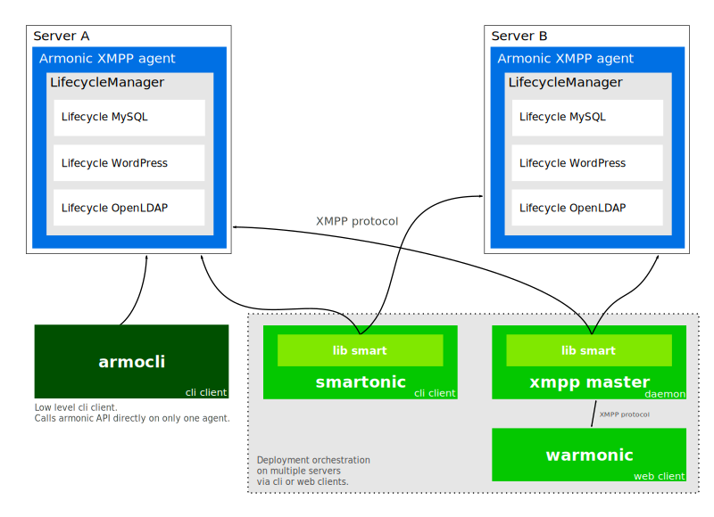

Armonic
#######

Armonic is a state machine system oriented for deployment written in python.

With Armonic you can express the different states of an application or a
service and make relations with other services. States can also provide
management methods to interact with the service.

Each Lifecycle (a state machine) representing an application or a service is
written in python. If you know already python it's really easy to get started
(See :ref:`lifecycle`).

Client tools are provided to interact with your collection of Lifecycles.

Architecture
============

Using CLI or Web frontends you can interact with Smartonic to manage the
deployment process. When a deployment is asked Smartonic resolve the
deployment path across all concerned severs. Smartonic then translate the
requirements to achieve the deployment to the frontend. The frontend fills
manually or automatically the requirements and then ask Smartonic to orchestrate
the deployment.

Quickstart
==========

Running the agents
------------------

Using armonic-cli
-----------------

Howto
#####

.. toctree::
   :maxdepth: 1

   howto_lifecycle

Complete documentation
######################

.. toctree::
   :maxdepth: 2

   lifecycle
   components
   smart
   api
   howto_orchestration

Indices and tables
==================

* :ref:`genindex`
* :ref:`modindex`
* :ref:`search`
